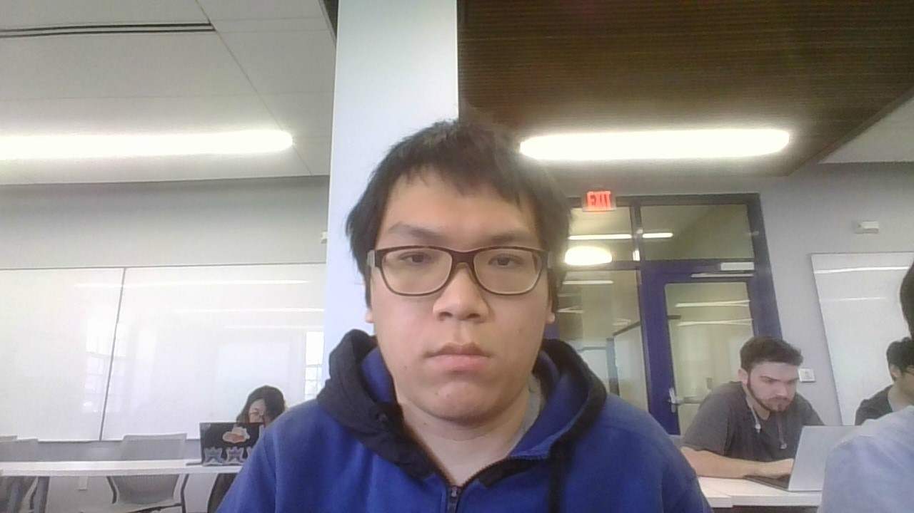
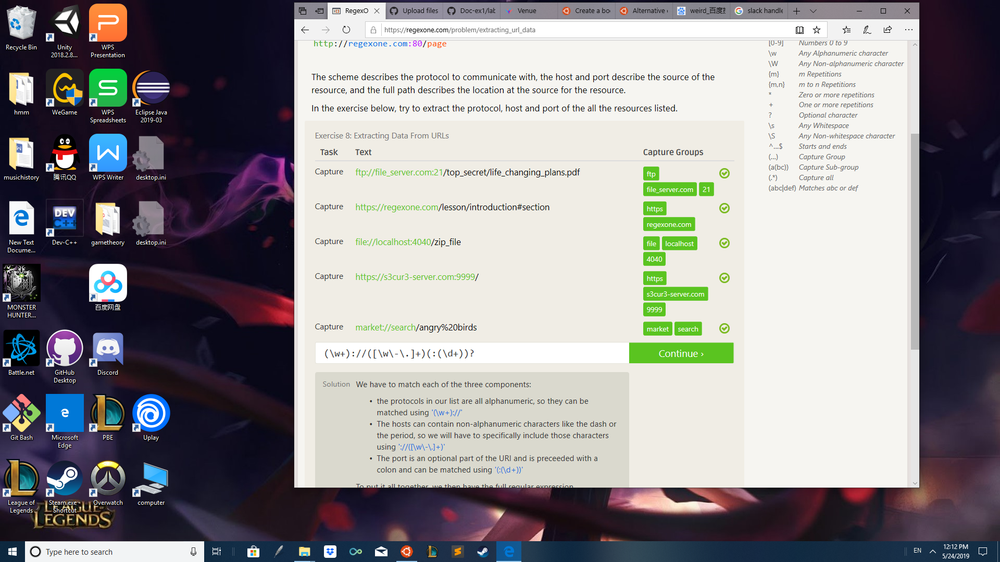
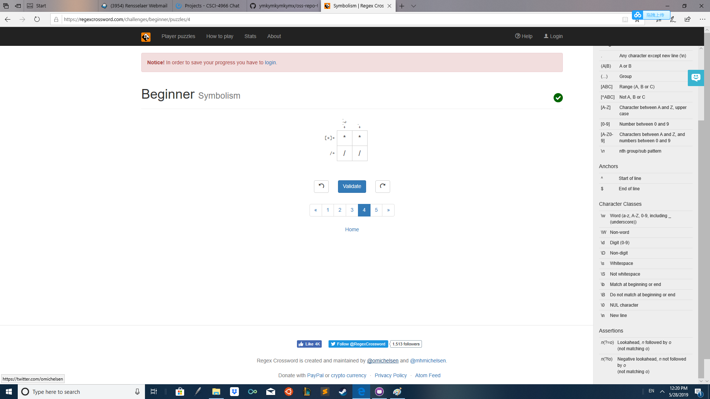
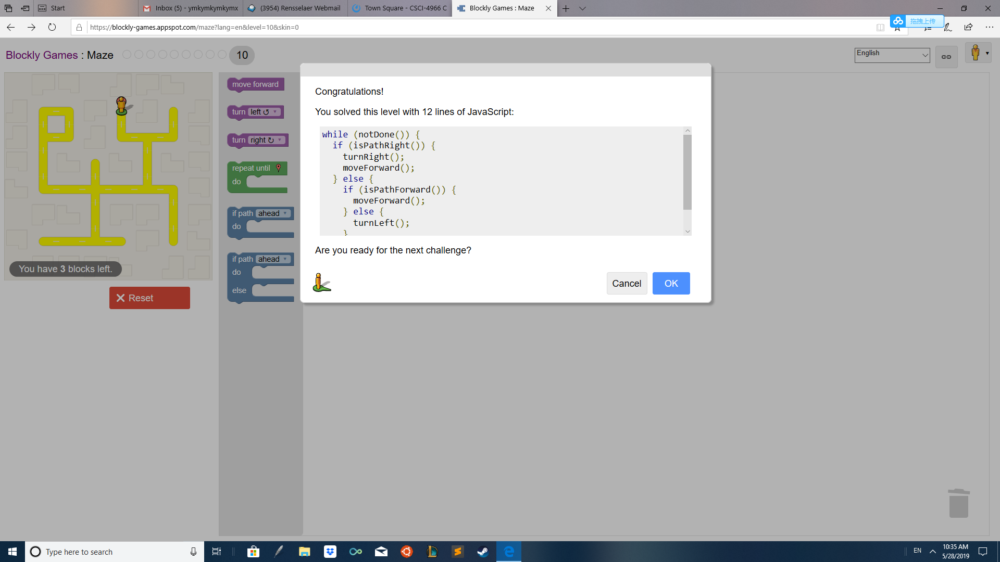

## Lab1

## Name: Minke Yu
### email: yum4@rpi.edu 
### office I don't have one
### github account: ymkymkymkymx
### slack handle: ymk
Photo of Mark Yu 

### problem 7:
     
### problem 8:Review of CHAPTER THREE: Catalogs
#### This chapter tell us a story about how your deed on the internet can destroy your life. I feel sad for the student that get bullied by the bloody law, but there is nothing I can do. Bad and weird things happpen everyday, and the only thing we can do is to try to avoid it. What I get from the paragarph is that I should never modify the software of established companies so that they cant sue me. Moreover, I should try my best to avoid putting my works online unless I determine to make it open source. In conclusion, internet is really dangerous and I should be really careful with it.

### problem 13: 
      
### problem 15:
#### insanse questions: 

### problem 16: 

### problem 18: 
